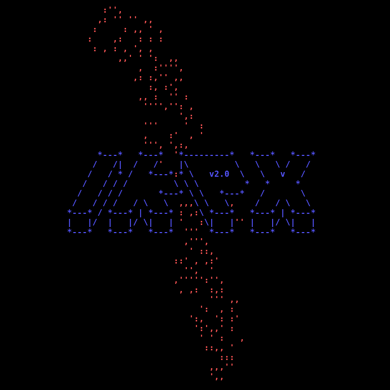
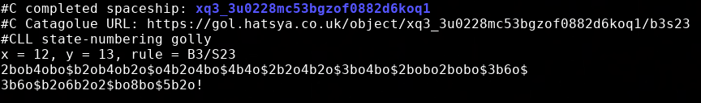

# Incremental Knightship Partial Extender, version 2.0

This is an optimised native-code successor to the Python program `ikpx`
responsible for the [discovery of Sir Robin][1].

The main differences between `ikpx2` and the original `ikpx` are:

 - Uses better SAT solvers (Armin Biere's [Kissat][2] and [CaDiCaL][6]);
 - Runs in a single multithreaded process, so no communication overhead;
 - Supports arbitrary isotropic rules, not just B3/S23;
 - Incorporates symmetry when searching orthogonal velocities;
 - No longer uses suboptimal lattice bases;
 - Easier to use (inputs and outputs are all RLE).

Moreover, as there is no Python interpreter involved at runtime, the
program is much more efficient in terms of speed and memory usage.

## Quick start

To build `ikpx2` for the default rule (B3/S23), simply run:

    ./recompile.sh

To specify a different rule such as B38/S23, run:

    ./recompile.sh --rule b38s23

The set of rules supported are isotropic 2-state Moore-neighbourhood
cellular automata. This includes familiar Life-like cellular automata,
in addition to non-totalistic rules expressed in [Hensel notation][3].

You can then search for a spaceship of a particular velocity using:

    ./ikpx2 --velocity 'c/3'

By default, this will use 8 CPU threads. The number of threads can be
specified by the `--threads` option. For a complete list of options,
run:

    ./ikpx2 --help

## Example output

The console output from `ikpx2` displays RLEs of the current longest
partial (whenever the record is broken) and any complete spaceships
found. When a complete spaceship is reported, the [apgcode][5] of the
spaceship is included together with the RLE:

This includes a link to the object page on Catagolue.

## Extending partials

By default, `ikpx2` attempts to find complete spaceships. If you instead
want to extend a partial, provide an RLE such as:

    ./ikpx2 --velocity '(2,1)c/6' docs/almost.rle

You can provide multiple files, one after another, if you have several
partials that you're interested in extending. (They must all be the
same velocity, matching the command-line argument, and operate in the
same rule in which `ikpx2` has been compiled.)

The partial in the RLE must move at the specified velocity, either north
(if orthogonal), north-west (if diagonal), or somewhere in between (if
oblique). This is the same direction as the partials outputted by `ikpx2`.

## Resuming searches

Every hour (or other period configurable using the `-b` option), `ikpx2`
will save a descriptively-named backup file in the working directory (or
other directory configurable using the `-d` option). To resume a search,
just include the backup file on the command line in the same way that
you can include an RLE on the command line.

When resuming a search, you can load additional partials: if you've
been running a different search program such as `ntzfind` and want to
incorporate the results into your ongoing `ikpx2` search, wait until it
produces a backup, terminate the process, and resume `ikpx2` from the
backup with the new partial included:

    ./ikpx2 -v '(2,1)c/6' backup_name.bin partial_name.rle

When you resume a search, you are free to change hyperparameters such
as the number of CPU threads.

## Acknowledgements

Thanks go to Armin Biere for [Kissat][2] and [CaDiCaL][6], and to Cameron
Desrochers for the [lock-free concurrent queue][4].

[1]: https://cp4space.wordpress.com/2018/03/11/a-rather-satisfying-winter/
[2]: https://github.com/arminbiere/kissat
[3]: https://www.conwaylife.com/wiki/Hensel_notation
[4]: https://github.com/cameron314/concurrentqueue
[5]: https://conwaylife.com/wiki/Apgcode
[6]: https://github.com/arminbiere/cadical
